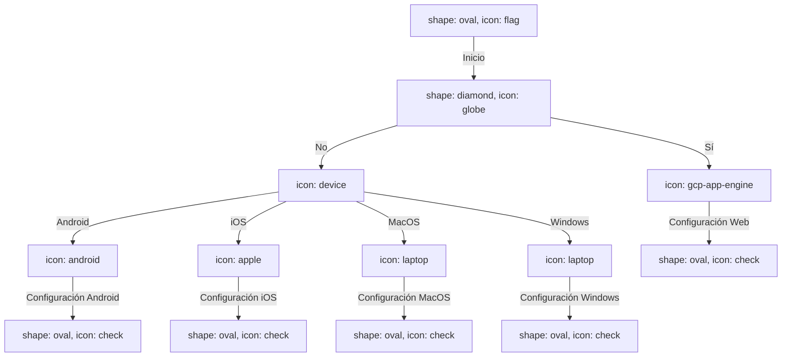

## Diagrama de Flujo Firebase Options Configuration Flowchart
Este diagrama de flujo describe el proceso de configuración de opciones en Firebase según la plataforma de destino.

### Explicación

- **Inicio:** El proceso comienza en el nodo "Inicio".
- **CheckIfWeb:** Se verifica si la aplicación es una aplicación web.  
    - Sí: La configuración se realiza utilizando la configuración web de Firebase.
    - No: Se determina la plataforma de destino.
- **DeterminePlatform:** Según la plataforma de destino, se realiza la configuración correspondiente.
    - Android: Configuración específica para Android.
    - iOS: Configuración específica para iOS.
    - MacOS: Configuración específica para MacOS.
    - Windows: Configuración específica para Windows.
- **EndWebConfig, EndAndroidConfig, EndiOSConfig, EndMacOSConfig, EndWindowsConfig:** Fin del proceso de configuración para cada plataforma específica.
## Diagrama Secuencias Firebase Authentication
Este diagrama de secuencia describe el flujo de autenticación en Firebase para las operaciones de registro e inicio de sesión.

### Registro de Usuario

sequence
Client [icon: user] > FirebaseAuthService: Register request
activate Client
FirebaseAuthService [icon: firebase] > FirebaseAuth [icon: firebase]: Create user
alt [label: if registration successful]
  FirebaseAuth - FirebaseAuthService: User object
  FirebaseAuthService --> Client: User object
else [label: if registration fails]
  FirebaseAuthService --> Client: Null response
end
deactivate Client

### Explicación

1. El usuario (`**Client**` ) envía una solicitud de registro (`**Register request**` ) al servicio de autenticación de Firebase (`**FirebaseAuthService**` ).
    
2. El servicio de autenticación (`**FirebaseAuthService**` ) interactúa con Firebase (`**FirebaseAuth**` ) para crear un nuevo usuario.
    
3. Si el registro es exitoso, se obtiene un objeto de usuario y se envía de vuelta al usuario. Si falla, se devuelve una respuesta nula.
    

### Inicio de Sesión

sequenceCopy codeClient [icon: user] > FirebaseAuthService: Sign-in request
activate Client
FirebaseAuthService [icon: firebase] > FirebaseAuth [icon: firebase]: Authenticate user
alt [label: if sign-in successful]
  FirebaseAuth - FirebaseAuthService: User object
  FirebaseAuthService --> Client: User object
else [label: if sign-in fails]
  FirebaseAuthService --> Client: Null response
end
deactivate Client

### Explicación

1. El usuario (`**Client**` ) envía una solicitud de inicio de sesión (`**Sign-in request**` ) al servicio de autenticación de Firebase (`**FirebaseAuthService**` ).
    
2. El servicio de autenticación (`**FirebaseAuthService**` ) autentica al usuario en Firebase (`**FirebaseAuth**` ).
    
3. Si el inicio de sesión es exitoso, se obtiene un objeto de usuario y se envía de vuelta al usuario. Si falla, se devuelve una respuesta nula.
    

