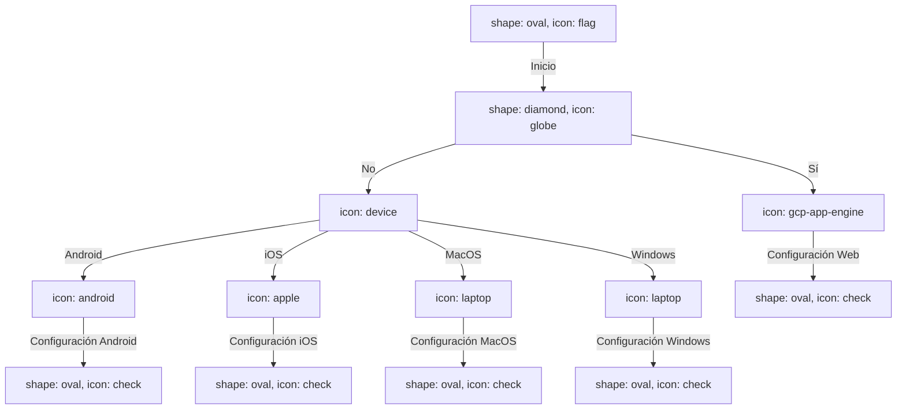

## Diagrama de Flujo Plataformas
Este diagrama de flujo describe el proceso de configuración de opciones en Firebase según la plataforma de destino.

### Explicación

- **Inicio:** El proceso comienza en el nodo "Inicio".
- **CheckIfWeb:** Se verifica si la aplicación es una aplicación web.  
    - Sí: La configuración se realiza utilizando la configuración web de Firebase.
    - No: Se determina la plataforma de destino.
- **DeterminePlatform:** Según la plataforma de destino, se realiza la configuración correspondiente.
    - Android: Configuración específica para Android.
    - iOS: Configuración específica para iOS.
    - MacOS: Configuración específica para MacOS.
    - Windows: Configuración específica para Windows.
- **EndWebConfig, EndAndroidConfig, EndiOSConfig, EndMacOSConfig, EndWindowsConfig:** Fin del proceso de configuración para cada plataforma específica.
![[diagram-export-27-1-2024-18_39_51.png]]
## Diagrama Secuencias Firebase Authentication
Este diagrama de secuencia describe el flujo de autenticación en Firebase para las operaciones de registro e inicio de sesión.

### Registro de Usuario

sequence
Client [icon: user] > FirebaseAuthService: Register request
activate Client
FirebaseAuthService [icon: firebase] > FirebaseAuth [icon: firebase]: Create user
alt [label: if registration successful]
  FirebaseAuth - FirebaseAuthService: User object
  FirebaseAuthService --> Client: User object
else [label: if registration fails]
  FirebaseAuthService --> Client: Null response
end
deactivate Client

### Explicación

1. El usuario (`**Client**` ) envía una solicitud de registro (`**Register request**` ) al servicio de autenticación de Firebase (`**FirebaseAuthService**` ).
    
2. El servicio de autenticación (`**FirebaseAuthService**` ) interactúa con Firebase (`**FirebaseAuth**` ) para crear un nuevo usuario.
    
3. Si el registro es exitoso, se obtiene un objeto de usuario y se envía de vuelta al usuario. Si falla, se devuelve una respuesta nula.
    

### Inicio de Sesión

sequenceCopy codeClient [icon: user] > FirebaseAuthService: Sign-in request
activate Client
FirebaseAuthService [icon: firebase] > FirebaseAuth [icon: firebase]: Authenticate user
alt [label: if sign-in successful]
  FirebaseAuth - FirebaseAuthService: User object
  FirebaseAuthService --> Client: User object
else [label: if sign-in fails]
  FirebaseAuthService --> Client: Null response
end
deactivate Client

### Explicación

1. El usuario (`**Client**` ) envía una solicitud de inicio de sesión (`**Sign-in request**` ) al servicio de autenticación de Firebase (`**FirebaseAuthService**` ).
    
2. El servicio de autenticación (`**FirebaseAuthService**` ) autentica al usuario en Firebase (`**FirebaseAuth**` ).
    
3. Si el inicio de sesión es exitoso, se obtiene un objeto de usuario y se envía de vuelta al usuario. Si falla, se devuelve una respuesta nula.
    

Este documento describe la arquitectura en la nube utilizando Firebase para gestionar servicios de autenticación y almacenamiento de datos en Cloud Firestore.

## Firebase Services

- **Authentication:** Servicio de Firebase para la autenticación de usuarios.

- **Firestore Database:** Base de datos en tiempo real y en la nube proporcionada por Firebase.
## Cloud Firestore

- **Clients:** Colección en Cloud Firestore para almacenar datos de clientes.

- **Vehicles:** Colección en Cloud Firestore para almacenar datos de vehículos.

- **Work Orders:** Colección en Cloud Firestore para almacenar datos de órdenes de trabajo.

- **Order Summary:** Colección en Cloud Firestore para almacenar resúmenes de órdenes.
## Conexiones

- **Authentication > Firestore Database:** Integración entre el servicio de autenticación de Firebase y la base de datos Firestore.
- **Firestore Database > Cloud Firestore:** Conexión entre el servicio Firestore Database de Firebase y Cloud Firestore para almacenar y recuperar datos.

![[diagram-export-27-1-2024-18_41_15.png]]
---

Este es un resumen de la arquitectura en la nube utilizando Firebase. Asegúrate de personalizar la documentación según las características específicas de tu aplicación y las necesidades de tu proyecto.

## Diagrama de Entidad Relación Firebase Service 
Este diagrama de entidad-relación (ERD) representa la estructura de datos para el servicio Firebase.
### Explicación

- **people:** Representa la colección de usuarios.
- **counters:** Almacena los contadores asociados a los usuarios para el número de órdenes.
- **clients:** Almacena datos de clientes.
- **vehicles:** Almacena datos de vehículos.
- **workOrders:** Contiene información sobre las órdenes de trabajo, incluyendo servicios y repuestos.
- **orderSumary:** Almacena resúmenes de las órdenes.

### Relaciones

- **people.counters.orderNumber > counters.id:** Relación entre el contador y el número de órdenes asociado a los usuarios.
- **people.clients <> clients.uid:** Relación entre la colección de usuarios y los clientes.
- **people.vehicles <> vehicles.uid:** Relación entre la colección de usuarios y los vehículos.
- **people.workOrders <> workOrders.uid:** Relación entre la colección de usuarios y las órdenes de trabajo.
- **workOrders.clientId > clients.uid:** Relación entre las órdenes de trabajo y los clientes.
- **workOrders.vehicleId > vehicles.uid:** Relación entre las órdenes de trabajo y los vehículos.
- **people.orderSumary <> orderSumary.id:** Relación entre la colección de usuarios y los resúmenes de órdenes.

---

Este es un resumen de tu modelo de entidad-relación para el servicio Firebase. Asegúrate de ajustar y personalizar la documentación según las características específicas de tu aplicación y las necesidades de tu proyecto.